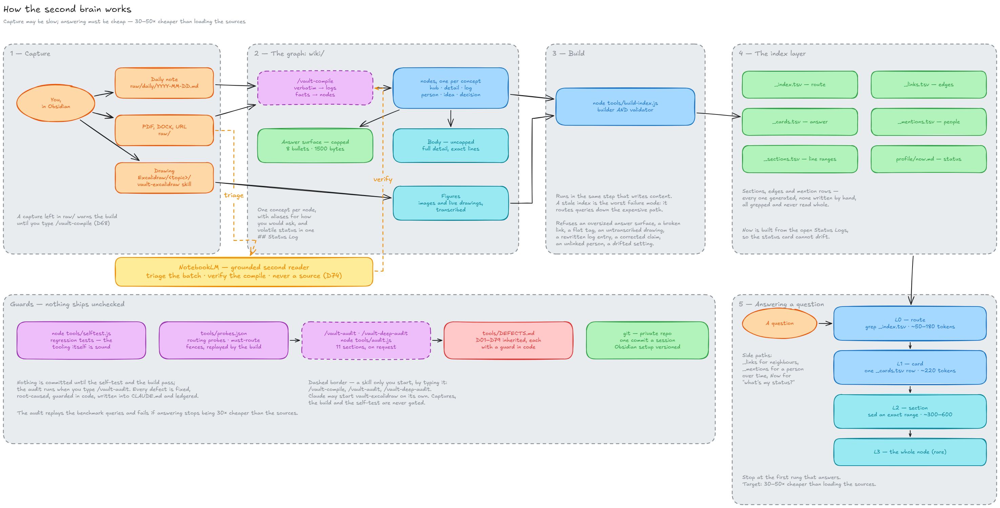

# Second Brain

An Obsidian vault that Claude Code runs for you, built so that answering from your notes costs a few hundred tokens instead of all of them.

[](https://github.com/Vifert/second-brain-template/actions/workflows/ci.yml)
[](https://github.com/Vifert/second-brain-template/releases/latest)
[](LICENSE)

## What it is

You capture anything — quick notes, a daily log, documents, ideas, drawings —
and Claude compiles it into a knowledge graph of small, linked notes. Every
note leads with a capped answer surface and keeps its full detail below it, and
a generated index lets a question reach the right lines without reading
anything else. Capture can be slow and thorough; answering stays cheap.

**The claim it defends: answering costs 30–50× less than loading your notes,
and nothing is summarised away to get there.** In the vault this method was
built in, the route-and-card lookup measures a median of about 44× cheaper
than loading its ~16,800 tokens of sources. On the shared fictional benchmark
in [`bench/`](bench/README.md), the first scorecard is 27× on an ~11,000-token
corpus, where a smaller corpus lowers the ratio for the same answer.

<picture>
  <source media="(prefers-color-scheme: dark)" srcset="docs/assets/architecture-dark.png">
  
</picture>
<!-- drawing-hash: 49dd368b -->

The drawing as text, and what each stage does: [docs/architecture.md](docs/architecture.md).

## Three ways in

**Convert the vault you already have** — the usual case. Download or clone
this repository anywhere, open Claude Code **in your vault's folder**, and say:

> Read `<path to this folder>/SETUP.md` and set up my vault.

Claude backs your vault up first, deletes none of your notes, and works only in
your vault — it never changes this folder.

**Start fresh.** Click **Use this template** (or download it), put the folder
where your vault should live, open Claude Code **in that folder**, and say:

> Read SETUP.md and set up my second brain.

Either way Claude first studies how this template works, then interviews you
in rounds about what you need the vault for — every question comes with its
recommended answer — and walks you through every step. The template is a
foundation: from your answers Claude proposes the skills, subagents and rules
your own use needs (a daily research routine, interview preparation, rules for
a work-only vault) and builds the ones you pick. `SETUP.md` is written for
Claude; you never need to read it.

**Just read about it.** [docs/how-it-works.md](docs/how-it-works.md) explains
the method without installing anything.

## Requirements

- [Obsidian](https://obsidian.md)
- [Claude Code](https://docs.anthropic.com/en/docs/claude-code)
- Node.js 20 or newer — the tools need nothing installed beyond it
- git
- The **Excalidraw** plugin, installed for you by `node tools/install-excalidraw.js`
- Recommended: the **Calendar**, **Iconize** and **Templater** plugins —
  see [docs/plugins.md](docs/plugins.md)

## Your commands

| Command | Does |
| --- | --- |
| `/vault-compile` | Compiles what is waiting in `raw/` into the knowledge graph |
| `/vault-audit` | A cheap health check of the vault, then asks which problems to fix |
| `/vault-deep-audit` | The expensive check, with agents asking questions in your words |
| `/vault-handoff` | Records the session in `HANDOFF.md`, so the next session starts where this one ended |
| `/vault-tailor` | Fits the vault to a new need: studies it, interviews you in rounds, then proposes and builds new skills, subagents or rules |

Claude cannot start the first four on its own — only you do, by typing them.
`/vault-tailor` runs once during setup, and again whenever you type it or ask
Claude to adapt the vault.

## What the tooling guarantees

- **The build is the validator.** `node tools/build-index.js` regenerates the
  index after every write and refuses anything that breaks a rule: an
  oversized answer surface, a broken link, an untranscribed image, a rewritten
  log entry, a claim you corrected.
- **The tooling tests itself.** `node tools/selftest.js` runs over 300
  regression tests.
- **Every rule traces to a defect.** [`tools/DEFECTS.md`](tools/DEFECTS.md)
  records each mistake found while the method was built — what went wrong, why,
  and the guard that stops it happening again — with the guard's code citing
  its ID.

## FAQ

**Does this need Claude Code?** The vault is plain markdown and stays readable
in Obsidian without it. Compiling, auditing and cheap answering are done by
Claude Code following `CLAUDE.md`; other agents are on the
[roadmap](ROADMAP.md).

**Does anything leave my machine?** The tools send nothing anywhere. The only
download is the pinned, checksum-verified Excalidraw plugin. Claude Code sends
what it reads to its model provider, as it does in any folder — and the point
of this method is that it reads very little. Details in
[SECURITY.md](SECURITY.md#the-data-model).

**What does it cost to run?** Answering: a few hundred tokens a question.
Compiling is the expensive part, and it runs only when you type
`/vault-compile`: compiling the 20-source, 44 KB benchmark took about half an
hour and roughly US$15 of API usage.

**Can I use it without the drawings?** Yes. The Excalidraw plugin must be
installed, because the tools run on its engine, but you never have to draw.

**What if I already have a `CLAUDE.md`?** Setup saves yours as
`raw/their-previous-CLAUDE.md`, shows you its rules, and adds the ones you
still want to the end of the new one.

## How the method has improved

Every release that moves the [benchmark](bench/README.md) adds a row.

| Version | Cost | Routing | Fidelity | Orphans | Change |
| --- | --- | --- | --- | --- | --- |
| 1.0.0 | 27× | 66.7% | 69.4% | 0 | baseline |

## Contribute an idea

The method is young, and the most valuable contributions make it cheaper or
more faithful. Read the [roadmap](ROADMAP.md), then open an
[Improvement Proposal](https://github.com/Vifert/second-brain-template/issues/new/choose);
[CONTRIBUTING.md](CONTRIBUTING.md) explains how a proposal is measured.
Questions go to [SUPPORT.md](SUPPORT.md), security reports to
[SECURITY.md](SECURITY.md).

## Credit and citation

Designed and built by [Vifert](https://github.com/Vifert), improved by its contributors.

The setup interview is adapted from the `grilling` skill by
[Matt Pocock](https://github.com/mattpocock/skills), MIT licensed — see
[THIRD_PARTY_NOTICES.md](THIRD_PARTY_NOTICES.md).

If you use this architecture or build on it, please cite it — GitHub's
**Cite this repository** button reads [CITATION.cff](CITATION.cff):

```
Vifert. second-brain-template: a token-efficient Obsidian knowledge graph run
by Claude Code. https://github.com/Vifert/second-brain-template
```

Released under the [MIT licence](LICENSE).
