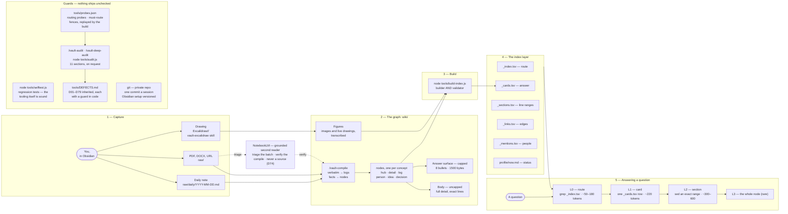

# The architecture

<picture>
  <source media="(prefers-color-scheme: dark)" srcset="assets/architecture-dark.png">
  
</picture>

The drawing is `Excalidraw/tooling/second-brain-architecture.excalidraw.md`,
editable in Obsidian. It argues that the five stages are a one-way pipeline
with a single validating step in the middle: nothing reaches the index layer
except through `tools/build-index.js`, and nothing reaches an answer except
through the index.

Below is the same drawing as text — the transcription the vault itself
retrieves from, in `wiki/tooling/second-brain-architecture.md` — so every box,
arrow and label is searchable.

Read alongside the flowchart:

- **Subtitle**: "Capture may be slow; answering must be cheap — 30–50× cheaper
  than loading the sources."
- **1 — Capture**: "A capture left in raw/ warns the build until you type
  /vault-compile (D68)."
- **2 — The graph**: "One concept per node, with aliases for how you would ask,
  and volatile status in one `## Status Log`."
- **3 — Build**: "Runs in the same step that writes content. A stale index is
  the worst failure mode: it routes queries down the expensive path." And:
  "Refuses an oversized answer surface, a broken link, a flat tag, an
  untranscribed drawing, a rewritten log entry, a corrected claim, an unlinked
  person, a drifted setting."
- **4 — The index layer**: "Sections, edges and mention rows — every one
  generated, none written by hand, all grepped and never read whole." And:
  "Now is built from the open Status Logs, so the status card cannot drift."
- **5 — Answering a question**: "Side paths: `_links` for neighbours,
  `_mentions` for a person over time, Now for 'what's my status?'" And: "Stop
  at the first rung that answers. Target: 30–50× cheaper than loading the
  sources."
- **NotebookLM** sits outside every stage, in amber, reached by two dashed
  arrows: `raw/` documents go to it for **triage** before a compile is planned,
  and its findings go back into **/vault-compile** as verification candidates. Dashed
  because it is advisory — it is consulted, never part of the pipeline, and a
  claim is never attributed to it (D74).
- **Guards**: "Nothing is committed until the self-test and the build pass; the
  audit runs when you type /vault-audit. Every defect is fixed, root-caused,
  guarded in code, written into CLAUDE.md and ledgered." And: "The audit replays
  the benchmark queries and fails if answering stops being 30× cheaper than the
  sources."
- **Legend** (under the guards): "Dashed border — a skill only you start, by
  typing it: /vault-compile, /vault-audit, /vault-deep-audit. Claude may start
  vault-excalidraw on its own. Captures, the build and the self-test are never
  gated." The two dashed purple boxes, **/vault-compile** and the audit box, are
  those gated skills (D78).

Colour carries meaning, so it survives here: orange is the owner's own input,
purple is a process Claude runs, blue is the main path, green is generated or
committed output, cyan is depth (body, figures, the deeper rungs), red is the
defect ledger, amber is an outside instrument that advises but never decides. Grey dashed boxes are stages, not files; a dashed purple box is a skill only the owner starts. The drawing carries no
counts on purpose, so it never goes stale; live figures come from `/vault-audit`.

For how each stage works and why, read [how-it-works.md](how-it-works.md).
