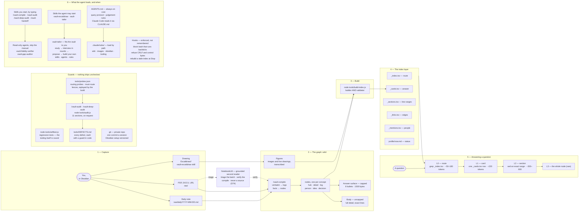

## Key Takeaways

- **The architecture drawing shows the whole machine** in five stages — capture, the wiki graph, the build, the index layer, answering — with the guards beneath and a sixth zone for what the agent loads, and when.
- **The drawing argues a one-way pipeline** with one validating step: nothing reaches the index layer except through `build-index.js`, and nothing reaches an answer except through the index.
- **Zone 6 shows the context cost**: an always-on `AGENTS.md` core (Claude Code reads it via `CLAUDE.md`), rules files that load by path, gated and open skills, two read-only agents that skip the manual, and hooks that enforce three traps.
- **Colour carries meaning in the drawing**: orange is the owner's input, purple a process the agent runs, blue the main path, green generated output, red what refuses a mistake, violet a read-only agent, amber an outside adviser.
- **The drawing carries no counts on purpose**, so it never goes stale; live figures come from `/vault-audit`. Edit it in Obsidian, then update the transcription and its drawing-hash.

## The Drawing

### Figure 1 — How the second brain works

![[second-brain-architecture.excalidraw|900]]

*Figure 1: capture, graph, build, index, answering — with the guards under
them, and what the agent loads beneath those.* The drawing is editable in
Obsidian; this transcription is what retrieval reads. It argues that the five
stages are a one-way pipeline with a single validating step in the middle:
nothing reaches the index layer except through `build-index.js`, and nothing
reaches an answer except through the index. Its bottom zone shows the other
half of the cost story: what the agent itself loads, and when.

Read alongside the flowchart:

- **Subtitle**: "Capture may be slow; answering must be cheap — 30–50× cheaper
  than loading the sources."
- **1 — Capture**: "A capture left in raw/ warns the build until you type
  /vault-compile (D68)."
- **2 — The graph**: "One concept per node, with aliases for how you would ask,
  and volatile status in one `## Status Log`."
- **3 — Build**: "Runs in the same step that writes content. A stale index is
  the worst failure mode: it routes queries down the expensive path." And:
  "Refuses an oversized answer surface, a broken link, a flat tag, an
  untranscribed drawing, a rewritten log entry, a corrected claim, an unlinked
  person, a drifted setting."
- **4 — The index layer**: "Sections, edges and mention rows — every one
  generated, none written by hand, all grepped and never read whole." And:
  "Now is built from the open Status Logs, so the status card cannot drift."
- **5 — Answering a question**: "Side paths: `_links` for neighbours,
  `_mentions` for a person over time, Now for 'what's my status?'" And: "Stop
  at the first rung that answers. Target: 30–50× cheaper than loading the
  sources."
- **NotebookLM** sits outside every stage, in amber, reached by two dashed
  arrows: `raw/` documents go to it for **triage** before a compile is planned,
  and its findings go back into **/vault-compile** as verification candidates. Dashed
  because it is advisory — it is consulted, never part of the pipeline, and a
  claim is never attributed to it (D74).
- **Guards**: "Nothing is committed until the self-test and the build pass; the
  audit runs when you type /vault-audit. Every defect is fixed, root-caused,
  guarded in code, written into the rules and ledgered." And: "The audit
  replays the benchmark queries and fails if answering stops being 30× cheaper
  than the sources."
- **Legend** (under the guards): "Dashed border — a skill only you start, by
  typing it: /vault-compile, /vault-audit, /vault-deep-audit, /vault-handoff.
  The agent may start vault-excalidraw and vault-tailor. Captures, the build
  and the self-test are never gated." The dashed purple boxes — **/vault-compile**,
  the audit box and the gated skills in zone 6 — are those skills (D78).
- **6 — What the agent loads, and when**: the always-on `AGENTS.md` core —
  Claude Code reads it through `CLAUDE.md` (D90) — points to the
  `.claude/rules/` files, which load only when a file they cover is read (D87).
  The gated skills dispatch the two read-only agents, which skip the manual and
  carry their own brief. `vault-tailor`, which the agent may start, fits the vault to its owner: it studies the design, interviews them in
  rounds, then proposes and builds their own skills, agents and rules. The
  hooks enforce three traps rather than trusting memory, and rebuild a stale
  index at the end of a turn. The note: "Budgets warn, never fail: past its
  token budget, AGENTS.md or HANDOFF.md warns, and detail moves to a rules
  file, a skill or a node — never deleted."

Colour carries meaning, so it survives here: orange is the owner's own input,
purple is a process the agent runs, blue is the main path and what always loads,
green is generated or committed output (and the tailoring that builds the
owner's own additions), cyan is depth (body, figures, the deeper rungs), red is
what refuses a mistake (the defect ledger and the hooks), violet is a read-only
agent, amber is an outside instrument that advises but never decides. Grey
dashed boxes are stages, not files; a dashed purple box is a skill only the
owner starts. The drawing carries no counts on purpose, so it never goes stale;
live figures come from `/vault-audit`.

<!-- drawing-hash: d659aefe -->

## Related

- [[second-brain-architecture|Second brain architecture]] — the design the drawing shows, and why it is shaped this way.
- [[excalidraw-drawings|Excalidraw drawings]] — how drawings stay editable and still retrievable.
- [[vault-skills|Vault skills]] — the six skills and the two agents in zone 6.
