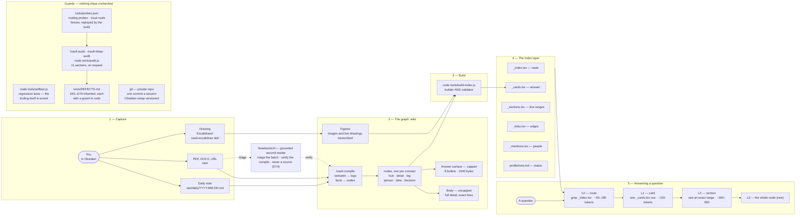

## Key Takeaways

- **{{OWNER_NAME}}'s second brain**, Obsidian + Claude Code at `{{VAULT_PATH}}`, on the architecture Vifert designed and built. It serves four jobs: retrieval, idea dump, daily updates, and shared working context.
- **The one design metric is query cost.** Capture may be arbitrarily slow; answering targets **30–50× cheaper** than loading source material — roughly 350–550 tokens for a point lookup.
- **The central idea: one file need not be both cheap to read and complete.** The *answer surface* is hard-capped at 8 bullets / 1500 bytes; the *body* is uncapped. Retrieval reads the surface; only depth questions touch the body, and then only exact lines.
- **Five generated index files** are the backbone — `_index` (route), `_cards` (answer), `_sections` (exact line ranges), `_links` (edges), `_mentions` (people over time) — plus a generated [[now|Now]] page. All grepped, never read whole.
- **Nodes declare a `kind`**, which sets the body budget and read path. Logs are uncapped because they are append-only and read by date range.
- **`raw/_compiled/` is disposable.** Day-level records live in the logs, named entities in `detail` nodes, papers as verbatim full text with figures transcribed.
- **Folders are for browsing, not cost**: topic first, then only `decisions/`, `worklog/` or `assets/`. The rebuild script validates all of it.

## The Whole Machine

### Figure 1 — How the second brain works

![[second-brain-architecture.excalidraw|900]]

*Figure 1: capture, graph, build, index, answering — with the guards under
them.* The drawing is editable in Obsidian; this transcription is what
retrieval reads. It argues that the five stages are a one-way pipeline with a
single validating step in the middle: nothing reaches the index layer except
through `build-index.js`, and nothing reaches an answer except through the
index.

Read alongside the flowchart:

- **Subtitle**: "Capture may be slow; answering must be cheap — 30–50× cheaper
  than loading the sources."
- **1 — Capture**: "A capture left in raw/ warns the build until you type
  /vault-compile (D68)."
- **2 — The graph**: "One concept per node, with aliases for how you would ask,
  and volatile status in one `## Status Log`."
- **3 — Build**: "Runs in the same step that writes content. A stale index is
  the worst failure mode: it routes queries down the expensive path." And:
  "Refuses an oversized answer surface, a broken link, a flat tag, an
  untranscribed drawing, a rewritten log entry, a corrected claim, an unlinked
  person, a drifted setting."
- **4 — The index layer**: "Sections, edges and mention rows — every one
  generated, none written by hand, all grepped and never read whole." And:
  "Now is built from the open Status Logs, so the status card cannot drift."
- **5 — Answering a question**: "Side paths: `_links` for neighbours,
  `_mentions` for a person over time, Now for 'what's my status?'" And: "Stop
  at the first rung that answers. Target: 30–50× cheaper than loading the
  sources."
- **NotebookLM** sits outside every stage, in amber, reached by two dashed
  arrows: `raw/` documents go to it for **triage** before a compile is planned,
  and its findings go back into **/vault-compile** as verification candidates. Dashed
  because it is advisory — it is consulted, never part of the pipeline, and a
  claim is never attributed to it (D74).
- **Guards**: "Nothing is committed until the self-test and the build pass; the
  audit runs when you type /vault-audit. Every defect is fixed, root-caused,
  guarded in code, written into CLAUDE.md and ledgered." And: "The audit replays
  the benchmark queries and fails if answering stops being 30× cheaper than the
  sources."
- **Legend** (under the guards): "Dashed border — a skill only you start, by
  typing it: /vault-compile, /vault-audit, /vault-deep-audit. Claude may start
  vault-excalidraw on its own. Captures, the build and the self-test are never
  gated." The two dashed purple boxes, **/vault-compile** and the audit box, are
  those gated skills (D78).

Colour carries meaning, so it survives here: orange is the owner's own input,
purple is a process Claude runs, blue is the main path, green is generated or
committed output, cyan is depth (body, figures, the deeper rungs), red is the
defect ledger, amber is an outside instrument that advises but never decides. Grey dashed boxes are stages, not files; a dashed purple box is a skill only the owner starts. The drawing carries no
counts on purpose, so it never goes stale; live figures come from `/vault-audit`.

<!-- drawing-hash: 49dd368b -->

## Why It Is Shaped This Way

In Vifert's vault the first build capped every article at ~120 lines. That looked efficient and
was not: it silently discarded **all 78 dated tracker entries**, because a
monthly narrative "covered" them. The wiki was 2.1× the size of its sources
while having lost the day-level record entirely — **size is not fidelity**.

The fix was to stop asking one file to do two jobs. Detail moved into logs and
`detail` nodes; the answer surface got a hard cap it never had before. Both
numbers improved at once: fidelity went to 78/78 entries preserved, and
measured retrieval went from 30× to 33–48× on point lookups.

## Measured Costs

Measured in Vifert's vault against its ~16,800-token naive baseline (all source
material in context). This vault measures its own whenever the owner
types `/vault-audit`, against the baseline set at setup (`BASELINE_BYTES` in
`tools/lib/rules.js`):

| Query shape | Path | Cost |
| --- | --- | --- |
| Point lookup | `_index.tsv` route → one card | ~350–500 tokens · **33–48×** |
| Named-concept lookup | direct card grep | ~220 tokens · **~60×** |
| Dated log entry | `_sections.tsv` → exact `sed` range | ~600 tokens · **27×**, full verbatim entry |
| Breadth survey | `_index.tsv` summaries only | ~850 tokens · legitimately more |

## Known Failure Modes

- **Broad card greps.** A term matching four cards costs ~1000 tokens and drops
  to 17×. Route on `_index.tsv` first, then pull one card.
- **Missing aliases.** A silent miss that forces an expensive fallback. Probe
  for them during an audit; in Vifert's vault a 58-term probe found 25 gaps on
  the first pass.
- **Obsidian rewriting frontmatter.** Opening a note converts inline alias lists
  to YAML block form and has been observed dropping entries — a silent
  retrieval outage. Rebuild the index after editing in Obsidian.
- **A stale index**, which routes queries down the expensive path with no error.

## Lineage

This architecture was designed and built by **Vifert** in his own vault, with
Claude Code, between 9 and 18 September 2026, and shared as a template — this
vault started from it. It resolved his evaluation of Obsidian-with-MCP against
Notion-with-MCP on token economics, context entropy and fragmentation risk.

Every part of it is his: the vault layout, the compile-and-move discipline, the
naming and people-node rules and the HANDOFF pattern; the retrieval architecture
— the index layer, the query ladder, the kind tiers and the answer-surface cap;
and everything that keeps it honest — the defect discipline and its 79 guarded
defects, the builder, audit and self-test, nested tag facets, the Obsidian
plugin rules, live drawings and NotebookLM.

## Related

- [[second-brain-architecture-layout|the folder layout in full]] — every path and what it holds,
  and why nesting costs nothing at query time.
- [[vault-operations|Vault operations]] — the day-to-day: query ladder, git, audit routine, known traps.
- [[vault-capture-protocol|Vault capture protocol]] — how things get in.
- [[vault-image-rules|Vault image rules]] — how figures are kept and transcribed.
- [[vault-tag-facets|Vault tag facets]] — why tags are nested facet/value, and what they buy at query time.
- [[obsidian-plugins|Obsidian plugins]] — the four plugins and the settings the build checks.
- [[excalidraw-drawings|Excalidraw drawings]] — how drawings stay editable and still retrievable.
- [[notebooklm-compile-support|NotebookLM in the compile]] — the grounded second reader, and why it never settles a claim.
